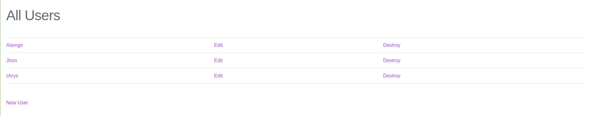
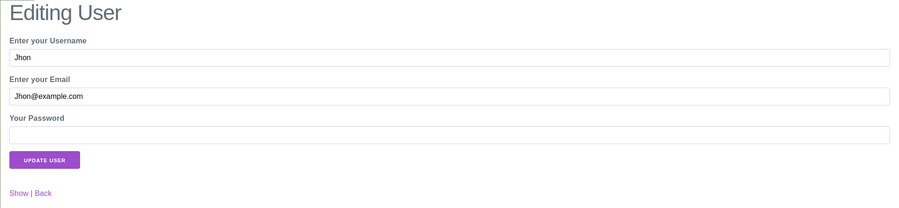
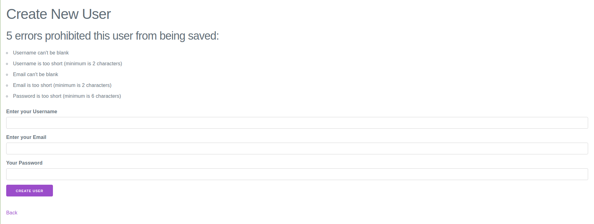

# Project: Bare Metal Forms and Helpers (Ruby on Rails)

## Ruby version

This is the fifth project of the Main Rails curriculum at [Microverse](https://www.microverse.org/) - @microverseinc

### Clone the project

- Clone the repo and run the app.

```bash
$ git clone https://github.com/M-Alamgir/re-former.git
$ cd re-former

```

### Run bundle install and migrate as follows:

```bash
bundle install

rails db:migrate
```

## Validations

```
`username` can not be blank and can be too short (minimum is 2 characters)
`email` can not be blank and can not exceed 25 characters
`password` can not be blank and can not be too short

```

## Screenshots

### Create user

`http://localhost:3000/users`


### Edit/Update user

`http://localhost:3000/users/1/edit`


### Form Validations



### Show user

`http://localhost:3000/users/1`


### Show all users

`http://localhost:3000/users`


## Ruby version

    ruby 2.7.0p0

## Rails version

    Rails 6.1.3.1

👤 **Alamgir**

- GitHub: [@ourandco](https://github.com/ourandco)
- Twitter: [@Alphacrescent1](https://twitter.com/Alphacrescent1)

## Show your support

Give ⭐ Star me on GitHub — it helps!

## 🤝 Contributing

Contributions, issues, and feature requests are welcome!

## 📝 License

This project is [MIT](https://opensource.org/licenses/MIT) licensed. 